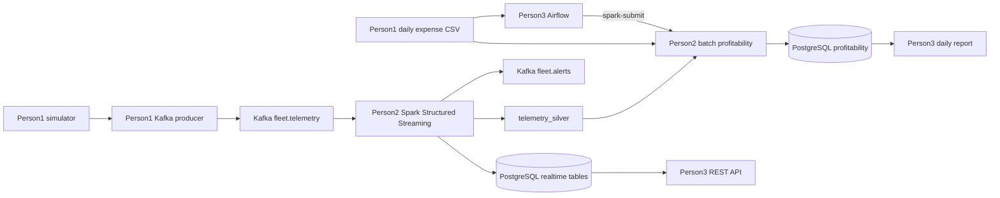

# Fleet Data Pipeline — Ride-Hailing Fleet Operations

EC8203 Mini Project. Group of 3. Use Case 1: live fleet utilization plus daily vehicle profitability.

## Architecture decision: Lambda, not Kappa

The brief requires two sources with different cadences:

- GPS/telemetry every few seconds (speed layer)
- One garage/fuel expense file per simulated day (batch layer)
- A serving API for “right now” metrics and a daily profitability report

**Lambda** fits this use case:

| Layer | Role | Owner |
|---|---|---|
| Speed | Spark Structured Streaming reads `fleet.telemetry`, windows, idle/no-data alerts | Person 2 |
| Batch | Spark job joins that day’s trip earnings with the expense CSV | Person 2 job, Person 3 Airflow trigger |
| Serving | PostgreSQL + REST API + daily report | Person 3 |

**Kappa** (everything through Kafka, replay the log for history) is the rejected alternative. Daily expense files are bounded extracts, not a continuous stream. Profitability is a once-per-day join, not a streaming aggregation. Forcing CSV drops through Kafka adds moving parts without helping the business question. At production scale Kappa can still make sense if expenses also become an event stream; for this two-week pipeline Lambda is the honest fit.

Simulated clock (assumption): **1 simulated day = 5 minutes** of wall clock. State this in the report and demo.



## Technology stack (justification)

| Layer | Tool | Why this use case |
|---|---|---|
| Ingestion | Apache Kafka, 3 partitions, key = `vehicle_id` | Ordered per-vehicle telemetry, replay for Spark checkpoints |
| Stream processing | Spark Structured Streaming | Watermarks, tumbling windows, Kafka source, JDBC sink — matches the brief |
| Batch processing | Spark batch job | Join daily expenses with trip earnings (max fare per trip) |
| Orchestration | Apache Airflow | Person 3 schedules the daily file + `spark-submit` |
| Serving store | PostgreSQL | Queryable store for the utilization API and daily report |
| Observability | JSON logs, `pipeline_health`, `fleet.alerts` | No-data and idle-vehicle rules from the brief |
| Local run | Docker Compose | Reproducible on Windows without installing Spark/Kafka |

## Team split

| Person | Folder | Status |
|---|---|---|
| 1 | [`ingestion/`](ingestion/README.md) | Simulator exists. Kafka producer and daily expense generator still required. |
| 2 | [`streaming/`](streaming/README.md) | Spark speed + batch jobs, analytics tables, tests, sample publisher. |
| 3 | [`orchenstrater/`](orchenstrater/README.md) | Airflow, PostgreSQL serving, REST API, daily report. Folder name is a typo; do not rename without the group. |

## Shared contracts

Kafka:

- Bootstrap (host): `localhost:9092`
- Bootstrap (Spark container): `kafka:29092`
- Input: `fleet.telemetry` (JSON, 3 partitions, key = `vehicle_id`)
- Alerts: `fleet.alerts`

Telemetry JSON (Person 1 → Person 2):

```json
{
  "trip_id": "T001",
  "driver_id": "D001",
  "vehicle_id": "V001",
  "lat": 6.9271,
  "lon": 79.8612,
  "speed": 42.5,
  "status": "on_trip",
  "fare": 820.0,
  "timestamp": "2026-09-27T20:30:00"
}
```

Daily expense CSV (Person 1 → Person 2 batch job):

```text
vehicle_id,fuel_cost,maintenance_cost,distance_covered,service_flag
V001,4200.50,1500.00,180.4,false
```

Sample file: [`data/batch/expenses_20260927.csv.example`](data/batch/expenses_20260927.csv.example)

Postgres database: `fleet`. Speed-layer tables: [`streaming/sql/analytics_tables.sql`](streaming/sql/analytics_tables.sql)

## Run the stack

```powershell
cd E:\BigDataProject
copy .env.example .env
docker compose up -d --build
```

Wait until Kafka, Postgres, and Spark are healthy. Then follow the Person 2 README to submit the streaming job.

Python unit tests (no Spark required):

```powershell
pip install -r streaming/requirements.txt
pytest streaming
```

## What is intentionally not in this repo yet

- `ingestion/producer.py` — Person 1
- Daily expense generator — Person 1
- Airflow DAGs and REST API — Person 3
