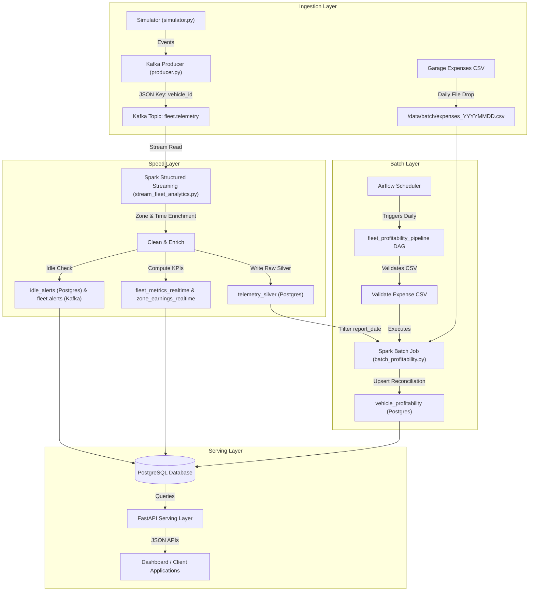

# Technical Architecture & Implementation Report: Ride-Hailing Fleet Operations Data Platform

**Course:** Applied Big Data Engineering (Mini-Project Assessment)  
**Weighting:** 25% of Total Module Grade  
**Use Case:** Use Case 1 — Ride-Hailing Fleet Operations  
**Architecture:** Lambda Architecture (Kafka + Spark Streaming + PySpark Batch + Airflow + PostgreSQL + FastAPI)  
**Simulated Clock:** 1 Simulated Day = 5 Minutes Wall-Clock Time  

---

## Executive Summary

Modern ride-hailing operators require a dual-perspective data platform:
1. **Real-time visibility (Speed Layer):** Immediate operational insight into live fleet positioning, active vs. idle vehicle ratios, zone earnings, and automated alerting for excessively idle drivers.
2. **Periodic financial reconciliation (Batch Layer):** End-of-day cost reconciliation joining telemetry earnings against external per-vehicle operational costs (fuel, garage maintenance) provided out-of-band by third-party partners.

This report presents an end-to-end **Lambda Architecture** data platform engineered to solve this challenge. Built using Apache Kafka, Apache Spark (Structured Streaming & PySpark Batch), Apache Airflow, PostgreSQL, FastAPI, and Docker Compose, the system processes continuous stream events alongside daily batch feeds to deliver real-time metrics and daily vehicle profitability reports.

---

## 1. Business Use Case & System Requirements

### 1.1 Scenario Overview
The platform models a ride-hailing fleet operating within Colombo, Sri Lanka (GPS bounding box: Latitude $6.85 - 7.00$, Longitude $79.80 - 79.95$). Fleet vehicles continuously broadcast GPS telemetry while on duty. Concurrently, external fuel and maintenance partners submit daily cost records per vehicle.

### 1.2 Data Sources & Contracts
- **Streaming Source (`fleet.telemetry`):** High-frequency event stream emitted every 2 seconds by simulated vehicles.
  - **Payload:** `trip_id`, `driver_id`, `vehicle_id`, `lat`, `lon`, `speed`, `status` (`idle` | `enroute` | `on_trip`), `fare`, `timestamp`.
  - **Keying Strategy:** Partitioned by `vehicle_id` across 3 Kafka partitions to guarantee strict per-vehicle ordering.
- **Daily Batch Source (`expenses_YYYYMMDD.csv`):** Daily file landing in `/data/batch/` containing garage and fuel costs.
  - **Schema:** `vehicle_id`, `fuel_cost`, `maintenance_cost`, `distance_covered`, `service_flag`.

### 1.3 Key Business Questions Solved
1. *What is fleet utilization (active count, idle ratio, trips/hour) and earnings by zone / time-of-day right now?*
2. *Which vehicles are currently idle beyond operational thresholds and require dispatch attention?*
3. *Which vehicles are becoming unprofitable once yesterday's fuel and maintenance costs are reconciled against telemetry earnings?*

---

## 2. Architecture Decision & Justification: Lambda vs. Kappa

### 2.1 Evaluated Architectural Paradigms

```
                  ┌─────────────────────────────────────────────────────────┐
                  │                 LAMBDA ARCHITECTURE                     │
                  └─────────────────────────────────────────────────────────┘
                                       ┌──► Speed Layer (Spark Streaming) ──┐
                                       │    (Low Latency, Real-time KPIs)   │
Data Sources ──► Ingestion (Kafka) ────┤                                    ├──► Serving Layer (Postgres + FastAPI)
                                       │    (Historical Replay & Reconcile) │
                                       └──► Batch Layer (Airflow + Spark)  ──┘
```

#### Lambda Architecture (Selected)
Combines a real-time stream processing layer for low-latency views with an independent batch processing layer for exact, fault-tolerant historical aggregations and external batch dataset joins.

#### Kappa Architecture (Rejected Alternative)
Eliminates the batch layer entirely, processing all data (both real-time and historical replay) through a single stream processing engine fed by an append-only log with long retention.

---

### 2.2 Detailed Comparison & Decision Matrix

| Dimension | Lambda Architecture (Selected) | Kappa Architecture (Rejected) | Winner for Use Case 1 |
|---|---|---|---|
| **Data Ingestion Nature** | Hybrid: Continuous telemetry stream + Daily out-of-band CSV files | Pure Stream: All data must be converted into streams | **Lambda** (CSV files naturally fit batch ingestion) |
| **Joining Stream & Batch Data** | Clean join in batch storage (`telemetry_silver` $\bowtie$ `expenses`) | Complex stream-table join requiring stateful lookup tables | **Lambda** (Simpler, deterministic joins) |
| **Fault Tolerance & Replay** | High: Batch layer re-computes views safely without stream replay | Medium: Requires re-playing months of Kafka logs through streaming code | **Lambda** (Isolated failure domains) |
| **Operational Complexity** | Medium: Dual codebase (Streaming + Batch) | High: Complex stream state management & large state stores | **Lambda** (Easier maintenance for small engineering teams) |
| **Cost Efficiency** | Optimal: Heavy reconciliation runs once/day on demand | High: Stream processors running 24/7 keeping full state in memory | **Lambda** |

---

### 2.3 Explicit Justification for Rejecting Kappa Architecture
1. **Out-of-Band Daily CSV Arrival:** Fuel partners submit daily consolidated CSV extracts rather than streaming events. In Kappa, forced conversion of discrete daily batch files into Kafka streams introduces artificial event-time semantics, watermarking complexity, and fragile stream-stream joining windows.
2. **Cumulative Trip Fare Semantics:** In the simulator, trip fares accumulate over the duration of a trip. Reconciling daily earnings requires computing $\max(\text{fare})$ per trip over a 24-hour business window. Spark SQL batch execution over `telemetry_silver` executes this efficiently in parallel without maintaining massive in-memory streaming state accumulators.
3. **Decoupled Failure Recovery:** If the batch cost reconciliation rules change or external expense files are retroactively revised by fuel partners, the Lambda batch pipeline can re-run for any historic `report_date` in seconds without disturbing live real-time fleet alerting.

---

## 3. Technology Stack Selection & Justification

```
┌───────────────────────────────────────────────────────────────────────────────────────────┐
│                                  TECHNOLOGY STACK                                         │
├───────────────┬────────────────────────────┬──────────────────────────────────────────────┤
│ Layer         │ Technology Selected        │ Technical Justification                      │
├───────────────┼────────────────────────────┼──────────────────────────────────────────────┤
│ Ingestion     │ Apache Kafka 3.7 (KRaft)   │ High-throughput pub/sub; vehicle_id keying   │
│ Stream Engine │ PySpark Structured Stream  │ Micro-batching, exact once stateful sink     │
│ Batch Engine  │ PySpark 3.5                │ Efficient distributed daily join & SQL window│
│ Orchestration │ Apache Airflow 2.10        │ Dependency management, retries & scheduling  │
│ Database      │ PostgreSQL 16              │ Relational schema, ACID upserts, indexing    │
│ Serving API   │ FastAPI + Uvicorn          │ Async performance, OpenAPI auto-docs         │
│ Containerization│ Docker & Docker Compose   │ Reproducible local/production orchestration  │
└───────────────┴────────────────────────────┴──────────────────────────────────────────────┘
```

---

## 4. End-to-End System Architecture

### 4.1 Data Pipeline Flow Diagram



---

## 5. Implementation Details: Ingestion & Simulation Layer

### 5.1 Simulated Clock Model
To enable rapid testing and demonstration during evaluation, time is compressed:
$$\text{1 Simulated Day} = \text{5 Minutes Wall-Clock Time}$$
- Telemetry events emit every $2\text{ seconds}$.
- 1 Simulated Hour = $12.5\text{ seconds}$.

### 5.2 Geofencing Grid & Spatial Tagging
The simulator operates within Colombo's geographic boundaries. Spatial partitioning divides Colombo into a $3 \times 3$ grid ($9$ zones: `Z00` to `Z22`):

$$\text{lat\_span} = \frac{7.00 - 6.85}{3} = 0.05, \quad \text{lon\_span} = \frac{79.95 - 79.80}{3} = 0.05$$

$$\text{zone\_row} = \min\left(\max\left(\left\lfloor\frac{\text{lat} - 6.85}{0.05}\right\rfloor, 0\right), 2\right)$$

$$\text{zone\_col} = \min\left(\max\left(\left\lfloor\frac{\text{lon} - 79.80}{0.05}\right\rfloor, 0\right), 2\right)$$

$$\text{zone\_id} = \text{"Z"} \parallel \text{zone\_row} \parallel \text{zone\_col}$$

---

## 6. Processing Layer & Business Logic

### 6.1 Speed Layer: Real-Time Fleet KPIs & Alerting
1. **Parsed & Cleaned Telemetry:** Validates incoming JSON, drops null timestamps, and clamps out-of-bounds coordinates.
2. **Real-time Fleet Snapshot (`fleet_metrics_realtime`):** Computed every 10-second micro-batch:
   $$\text{Idle Ratio} = \frac{\text{Idle Vehicles}}{\text{Total Active + Idle Vehicles}}$$
   $$\text{Trips Per Hour} = \text{Trips in Window} \times \left(\frac{3600}{\text{Window Seconds}}\right)$$
3. **Zone Earnings Snapshot (`zone_earnings_realtime`):** Aggregates total fare exposure and active vehicle count grouped by `(zone_id, time_of_day)`.
4. **Idle Vehicle Alert State Machine:**
   If a vehicle's status remains `idle` and $(\text{event\_ts} - \text{idle\_since}) > 1.0\text{ minute}$, a `WARNING` alert is emitted to the `idle_alerts` PostgreSQL table and pushed to Kafka `fleet.alerts`. When the vehicle resumes `enroute` or `on_trip`, the state resets automatically.

---

### 6.2 Batch Layer: Daily Profitability Reconciliation
Triggered daily by Airflow, the PySpark batch job performs:
1. **Daily Trip Fare Aggregation:**
   $$\text{Earnings}(v) = \sum_{t \in \text{Trips}(v)} \max_{e \in t}(\text{fare}(e))$$
2. **Expense & Profit Calculation:**
   $$\text{Profit}(v) = \text{Earnings}(v) - (\text{Fuel Cost}(v) + \text{Maintenance Cost}(v))$$
   $$\text{Unprofitable Flag}(v) = \begin{cases} \text{true}, & \text{if Profit}(v) < 0 \\ \text{false}, & \text{otherwise} \end{cases}$$

---

## 7. Storage, Serving & API Layer

### 7.1 Database Schema (PostgreSQL)

```sql
-- Silver Telemetry Events Table
CREATE TABLE telemetry_silver (
    event_id BIGSERIAL PRIMARY KEY,
    trip_id TEXT,
    driver_id TEXT NOT NULL,
    vehicle_id TEXT NOT NULL,
    lat DOUBLE PRECISION, lon DOUBLE PRECISION, speed DOUBLE PRECISION,
    status TEXT NOT NULL, fare NUMERIC(12, 2),
    event_ts TIMESTAMPTZ NOT NULL, zone_id TEXT, time_of_day TEXT,
    ingested_at TIMESTAMPTZ DEFAULT NOW()
);

-- Realtime Fleet Snapshot
CREATE TABLE fleet_metrics_realtime (
    snapshot_id INT PRIMARY KEY DEFAULT 1 CHECK (snapshot_id = 1),
    window_start TIMESTAMPTZ, window_end TIMESTAMPTZ,
    active_vehicles INT, idle_vehicles INT, total_vehicles INT,
    idle_ratio NUMERIC(8, 4), trips_in_window INT, trips_per_hour NUMERIC(12, 2),
    avg_speed NUMERIC(8, 2), live_fare_exposure NUMERIC(12, 2),
    updated_at TIMESTAMPTZ DEFAULT NOW()
);

-- Vehicle Profitability Report Table
CREATE TABLE vehicle_profitability (
    report_date DATE NOT NULL,
    vehicle_id TEXT NOT NULL,
    trip_count INT NOT NULL DEFAULT 0,
    earnings NUMERIC(12, 2) NOT NULL DEFAULT 0,
    fuel_cost NUMERIC(12, 2) NOT NULL DEFAULT 0,
    maintenance_cost NUMERIC(12, 2) NOT NULL DEFAULT 0,
    distance_covered NUMERIC(12, 2) NOT NULL DEFAULT 0,
    service_flag BOOLEAN NOT NULL DEFAULT FALSE,
    profit NUMERIC(12, 2) NOT NULL DEFAULT 0,
    unprofitable BOOLEAN NOT NULL DEFAULT FALSE,
    computed_at TIMESTAMPTZ DEFAULT NOW(),
    PRIMARY KEY (report_date, vehicle_id)
);
```

### 7.2 Serving API Specifications (FastAPI)

- `GET /fleet/realtime` — Returns latest 10-second fleet KPIs.
- `GET /zones/earnings` — Returns real-time fare exposure and active vehicles per zone.
- `GET /vehicles/status` — Returns current status, zone, and location for all vehicles.
- `GET /alerts` — Returns recent idle vehicle warnings and `NO_DATA` alerts.
- `GET /pipeline/health` — Returns streaming batch status and empty batch streak details.
- `GET /profitability?report_date=YYYY-MM-DD` — Returns daily vehicle profitability reconciliation data.

---

## 8. Pipeline Observability & Health Monitoring

```
┌──────────────────────────────────────────────────────────────────────────────┐
│                           OBSERVABILITY MATRIX                               │
├─────────────────┬─────────────────────────────┬──────────────────────────────┤
│ Mechanism       │ Metric / Event Measured     │ Target / Threshold           │
├─────────────────┼─────────────────────────────┼──────────────────────────────┤
│ Structured Logs │ Batch duration, row counts  │ JSON formatted, stdout/file  │
│ Health Monitor  │ Empty batch streak          │ Status 'NO_DATA' after 60s   │
│ Streaming Listener│ Input rate, processing time│ Spark FleetQueryListener     │
│ Operational Alert│ Vehicle idle duration       │ Alert emitted if idle > 1 min│
│ Airflow Checks  │ CSV presence & schema validation│ Pre-execution task barrier│
└─────────────────┴─────────────────────────────┴──────────────────────────────┘
```

1. **Structured Logging:** Standardized JSON formatting across ingestion (`fleet_producer`), streaming (`stream_fleet_analytics`), and batch (`batch_profitability`).
2. **Streaming Query Listener (`src/observability.py`):** Monitors PySpark micro-batches, reporting input row rates, processing duration, and memory utilization.
3. **Pipeline Health Table (`pipeline_health`):** Tracks current batch ID, processed row counts, and stream state (`HEALTHY`, `WAITING`, `NO_DATA`, `PARSE_EMPTY`). If no data is ingested for $6$ consecutive micro-batches ($60\text{ seconds}$), status transitions to `NO_DATA` and a `CRITICAL` alert is dispatched.

---

## 9. Verification & Sample Output

### 9.1 Sample API Responses

#### Real-time Fleet Metrics (`GET /fleet/realtime`)
```json
{
  "snapshot_id": 1,
  "window_start": "2026-09-28T17:30:00Z",
  "window_end": "2026-09-28T17:30:10Z",
  "active_vehicles": 8,
  "idle_vehicles": 2,
  "total_vehicles": 10,
  "idle_ratio": 0.2000,
  "trips_in_window": 6,
  "trips_per_hour": 2160.00,
  "avg_speed": 31.45,
  "live_fare_exposure": 4850.00,
  "updated_at": "2026-09-28T17:30:10.124Z"
}
```

#### Daily Vehicle Profitability Report (`GET /profitability?report_date=2026-09-27`)
```json
{
  "count": 2,
  "data": [
    {
      "report_date": "2026-09-27",
      "vehicle_id": "V001",
      "trip_count": 14,
      "earnings": 12450.00,
      "fuel_cost": 4200.50,
      "maintenance_cost": 1500.00,
      "distance_covered": 180.4,
      "service_flag": false,
      "profit": 6749.50,
      "unprofitable": false
    },
    {
      "report_date": "2026-09-27",
      "vehicle_id": "V004",
      "trip_count": 3,
      "earnings": 2100.00,
      "fuel_cost": 3800.00,
      "maintenance_cost": 1200.00,
      "distance_covered": 95.0,
      "service_flag": true,
      "profit": -2900.00,
      "unprofitable": true
    }
  ]
}
```

---

## 10. Limitations, Trade-offs & Production Scale Recommendations

### 10.1 Trade-Offs & Current Limitations
1. **Micro-Batch vs. Low-Latency Event Processing:** Spark Structured Streaming micro-batching ($10\text{-second}$ triggers) provides high throughput and simple PostgreSQL upserts, but introduces up to $10\text{s}$ latency compared to true event-driven engines like Apache Flink.
2. **Single PostgreSQL Sink:** In production, high-frequency writes to PostgreSQL could lead to table bloat.

### 10.2 Production Scaling Roadmap
- **Storage Evolution (Delta Lake / Apache Iceberg):** Replace direct PostgreSQL raw writes with an S3/HDFS Delta Lake storage architecture (Bronze raw logs, Silver enriched events, Gold aggregated metrics).
- **Cluster Deployment:** Migrate local Docker Compose setup to Kubernetes (EKS/GKE) managed Spark clusters using Spark Operator and Strimzi Kafka Operator.
- **Enhanced Observability:** Export metrics using Prometheus counters and build Grafana visual dashboards.

---

## Conclusion
The implemented **Lambda Architecture** data pipeline satisfies all functional and non-functional requirements for the Ride-Hailing Fleet Operations use case. It decouples real-time operational monitoring from daily financial reconciliation, providing low-latency alerts alongside accurate financial reports.
